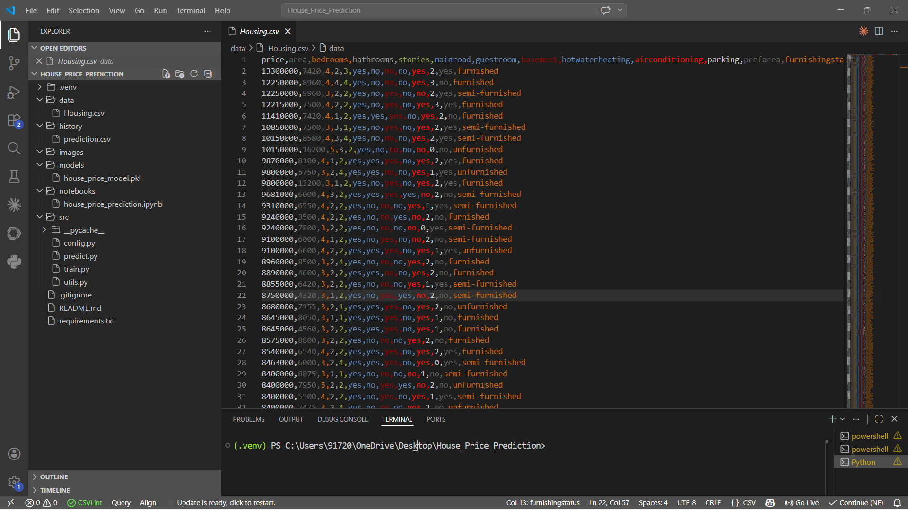
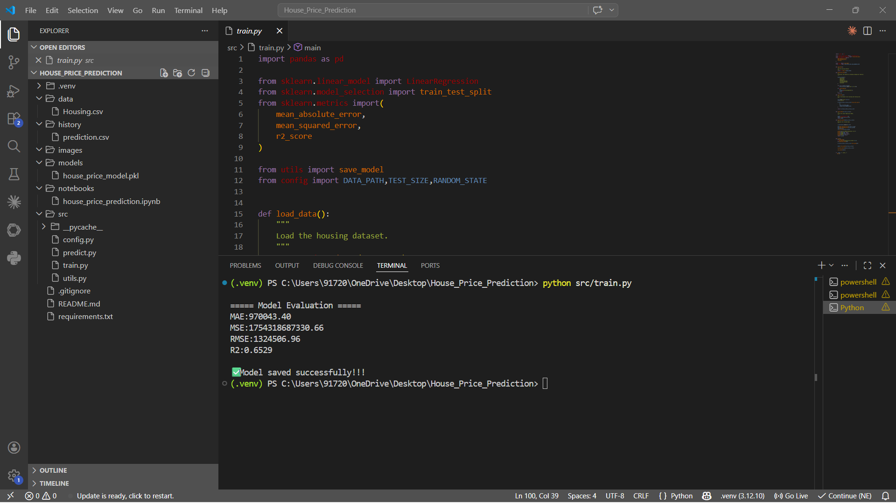
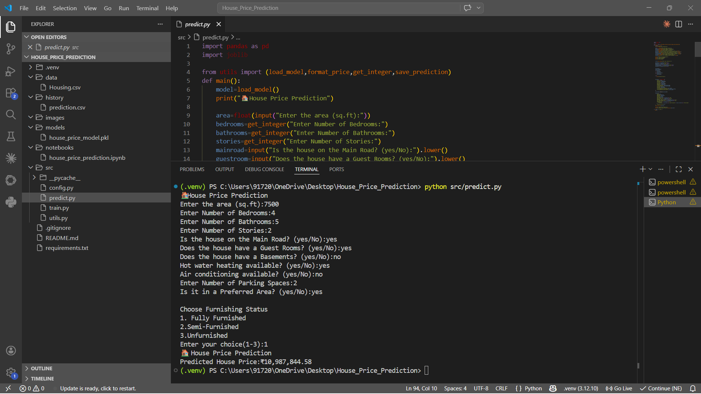
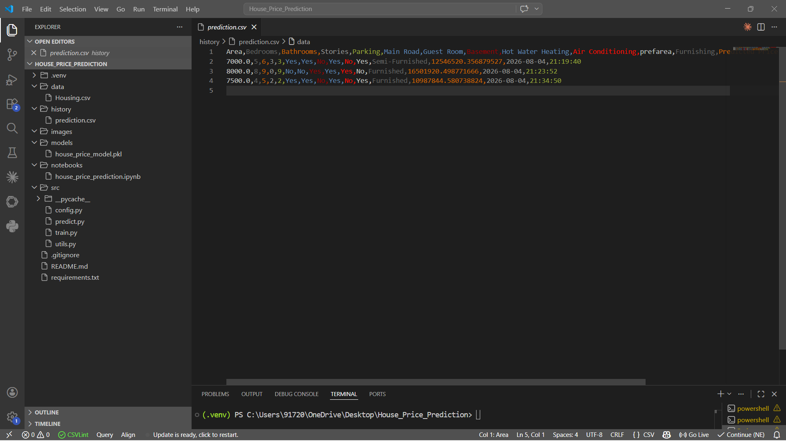
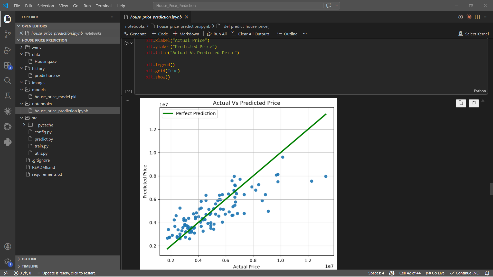
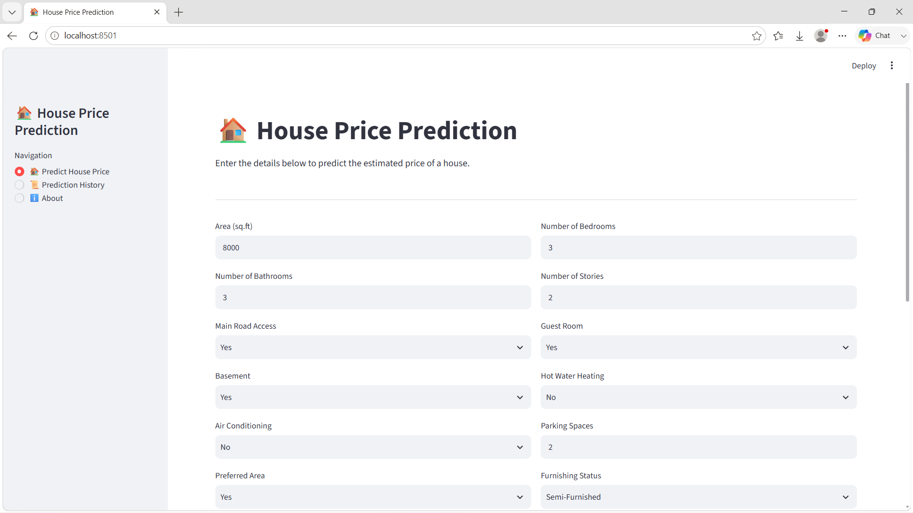
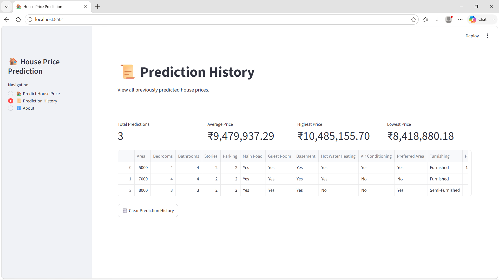

# 🏠 House Price Prediction using Machine Learning


## 📌 Project Overview

This Machine Learning project predicts house prices based on various property features using **Linear Regression**. The application allows users to train a model, predict the price of a new house, and maintain a history of all predictions.

### Features Used for Prediction

- Area
- Number of Bedrooms
- Number of Bathrooms
- Number of Stories
- Main Road Access
- Guest Room
- Basement
- Hot Water Heating
- Air Conditioning
- Parking
- Preferred Area
- Furnishing Status

---

# 📂 Project Structure

```text
House_Price_Prediction/
│
├── data/
│   └── Housing.csv
│
├── history/
│   └── prediction.csv
│
├── images/
│   ├── dataset_preview.png
│   ├── train_output.png
│   ├── prediction_output.png
│   ├── prediction_history.png
│   ├── scatter_plot.png
│   ├── home_page.png
│   ├── prediction_result.png
│   ├── prediction.png
│   └── about.png 
│
├── models/
│   └── house_price_model.pkl
│
├── notebooks/
│   └── house_price_prediction.ipynb
│
├── src/
│   ├── config.py
│   ├── train.py
│   ├── app.py
│   ├── predict.py
│   └── utils.py
│
├── requirements.txt
├── .gitignore
├── LICENSE
└── README.md
```

---

# 📊 Dataset

The project uses the **Housing Dataset** containing **545 houses**.

## Dataset Features

| Feature | Description |
|----------|-------------|
| price | House Price (Target Variable) |
| area | Area (Square Feet) |
| bedrooms | Number of Bedrooms |
| bathrooms | Number of Bathrooms |
| stories | Number of Stories |
| mainroad | Main Road Access |
| guestroom | Guest Room Availability |
| basement | Basement Availability |
| hotwaterheating | Hot Water Heating |
| airconditioning | Air Conditioning |
| parking | Number of Parking Spaces |
| prefarea | Preferred Area |
| furnishingstatus | Furnishing Status |

---

# ⚙️ Technologies Used

- Python
- Pandas
- NumPy
- Scikit-learn
- Matplotlib
- Streamlit
- Joblib
- Jupyter Notebook
- VS Code

---

# 🧠 Machine Learning Workflow

```text
Housing Dataset
        │
        ▼
Load Dataset
        │
        ▼
Data Preprocessing
        │
        ▼
Train-Test Split
        │
        ▼
Linear Regression Model
        │
        ▼
Model Evaluation
        │
        ▼
Save Model (.pkl)
        │
        ▼
Predict House Price
        │
        ▼
Store Prediction History
```

---

# 📈 Model Performance

| Metric | Value |
|--------|-------|
| MAE | 970,043 |
| RMSE | 1,324,507 |
| R² Score | 0.65 |

---

# 📸 Project Screenshots

## Dataset Preview



---

## Model Training



---

## House Price Prediction



---

## Prediction History



---

## Actual vs Predicted Scatter Plot



---

# 📸 Application Screenshots

### 🏠 Home Page



### 💰 Prediction Result


### 📜 Prediction History



### ℹ️ About Page


---

# ✨ Key Features

- ✅ Automatic Data Preprocessing
- ✅ Binary Feature Encoding
- ✅ Prediction result Dashboard
- ✅ House Price using Linear Regression Model
- ✅ Model Evaluation using MAE, RMSE and R² Score
- ✅ Save and Load Model using Joblib
- ✅ Command-Line House Price Prediction
- ✅ Prediction History Page
- ✅ Modular Python Project Structure
- ✅Inter-Active Streamlit Web Application

---

# 🚀 How to Run the Project

## 1. Clone the Repository

```bash
git clone <repository-url>
```

## 2. Move into the Project Folder

```bash
cd House_Price_Prediction
```

## 3. Create a Virtual Environment

```bash
python -m venv .venv
```

## 4. Activate the Virtual Environment

### Windows

```bash
.venv\Scripts\activate
```

### Linux / macOS

```bash
source .venv/bin/activate
```

## 5. Install Required Packages

```bash
pip install -r requirements.txt
```

---

# 🏋️ Train the Model

```bash
python src/train.py
```

The training script will:

- Load the dataset
- Preprocess the data
- Split into training and testing datasets
- Train the Linear Regression model
- Evaluate the model
- Save the trained model

---

# 🏡 Predict House Price

```bash
python src/predict.py
```

Enter the required house details when prompted.

Example:

```text
Area: 7500
Bedrooms: 4
Bathrooms: 5
Stories: 2
Parking: 2

Predicted Price:
₹1,09,87,844.58
```

---

# 📁 Prediction History

Every prediction is automatically stored in:

```text
history/prediction.csv
```

The file stores:

- Date
- Time
- House Details
- Predicted Price

---

# 🔮 Future Improvements

- Compare multiple Machine Learning models
- Random Forest Regression
- XGBoost Regression
- Hyperparameter Tuning
- Model Deployment
- FastAPI Integration
- Docker Support

---

# 👨‍💻 Author

**Developed by:** **Praveenkanth M**

Machine Learning Enthusiast | Python Developer

**GitHub:** https://github.com/Neopraveen234

**LinkedIn:** https://www.linkedin.com/in/praveenkanth-m

This project was developed as part of my Machine Learning learning journey using Python and Scikit-learn.

---

# 📄 License

This project is licensed under the **MIT License**.

---

# ⭐ Support

If you found this project useful, please consider giving it a ⭐ on GitHub.

Thank you for visiting this project!